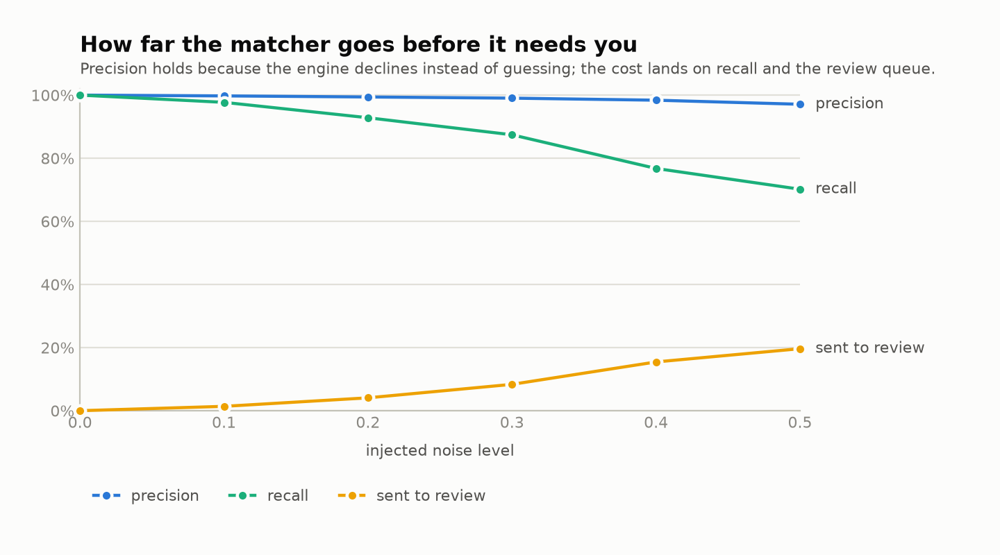

# settle

A payment-to-invoice reconciliation engine. Deterministic at its core, model-assisted only at the messy edge, and it tells you when it isn't sure.

*Here for the finance problem rather than the code? [What settle does, in plain English](docs/PLAIN-ENGLISH.md).*

*Want it in a browser rather than a terminal? That's [`settle-app`](app/README.md).*

> **Reconciliation is a logic problem with a messy edge.**
>
> Matching payments to invoices is deterministic: amounts, dates, customers and references are facts, and a payment either explains a set of invoices to the cent or it does not. settle solves that part with search and rules, and proves the invariants with property-based tests.
>
> The messy edge is the payment reference, a free-text field customers fill in however they like. That is the only place a model is used, and it only *proposes* candidates; the engine still verifies every proposal against the ledger, and anything below the confidence threshold goes to a human.
>
> Because the test data is generated, the truth is known. The benchmark shows how far the matcher goes before it needs you.

---

## Results first

Measured against generated ledgers with known ground truth: 400 invoices per run, 5 seeds per row, increasing noise on all four dimensions at once.

| noise | precision | recall | sent to review |
|---:|---:|---:|---:|
| 0.0 | 100.0% | 100.0% | 0.0% |
| 0.1 | 99.8% | 97.7% | 1.4% |
| 0.2 | 99.4% | 92.8% | 4.1% |
| 0.3 | 99.0% | 87.4% | 8.3% |
| 0.4 | 98.4% | 76.8% | 15.4% |
| 0.5 | 97.1% | 70.2% | 19.7% |

<picture>
  <source media="(prefers-color-scheme: dark)" srcset="bench/results/benchmark-dark.png">
  
</picture>

**Precision barely moves; recall carries the cost.** That is the design, stated as a measurement — the engine turns uncertainty into human work rather than into wrong allocations. A payment sent to review is not scored as a wrong answer, because the engine didn't claim anything; it costs recall and shows up in the review column, which is where a finance team actually feels it.

**The interesting finding is that no single kind of mess matters.** Each noise dimension alone scores 99%+ recall, because the signals are redundant: destroy the references and exact amounts still identify the payment. Pair reference noise with any second dimension and recall falls to 80–90%. Once the identifier is gone the amount is all that's left, and the second dimension is exactly what makes the amount unreliable.

Which gives a practical answer more useful than a score: **getting customers to put a usable reference on the payment is worth more than any improvement to the matcher.**

Full tables in [`bench/results/`](bench/results/results.md); methodology and the honest caveats in [`docs/EVAL.md`](docs/EVAL.md). `make bench-check` re-runs the benchmark and fails if the committed numbers no longer reproduce — CI runs it, so the numbers above can't quietly go stale.

---

## The problem

Money arrives in a bank account. Someone has to answer one question for every incoming line: **which invoices did this pay?**

In practice the answer is rarely clean. One transfer covers three invoices. A customer pays two thirds now and the rest next month. An international payment arrives 2.9% short because a bank took a fee in the middle. The reference says `INV-2026-0042`, or `szamla 42`, or `0042/2026`, or the customer's dog's name. Two invoices for the same customer carry the same amount on the same day.

settle handles each of those explicitly:

| Case | What it does |
|---|---|
| Exact match | Amount, currency, customer and date window all agree |
| One payment, several invoices | Bounded subset-sum with documented ordering and a node budget |
| Part payment | Allocates what arrived; the residual is first-class, and the next payment closes it |
| Overpayment | Closes the invoice, leaves the surplus as an explicit residual |
| Bank fee | A shortfall within tolerance closes the invoice as **`settled_with_fee`** — a different state from `paid`, with the shortfall recorded as a fee line, never silently absorbed |
| Messy reference | `INV-2026-0042`, `2026/0042`, `0042/2026`, `szamla 42`, `#42`, `20260042` all resolve by rule |
| Genuine ambiguity | Returns every tied candidate, ranked, and applies none of them |

Every allocation carries a confidence score and a stated reason — *"combination of 3 invoices, reference matched all 3"*, *"amount within fee tolerance, no reference"* — that travels into the output CSV a finance team opens.

---

## Quickstart

```bash
make install          # venv + dependencies
make test             # the suite
make demo             # generate a messy ledger, reconcile it, print the summary
```

```bash
settle run invoices.csv bank.csv --out results/
```

Real output from `make demo` (240 invoices, noise 0.3 on every dimension):

```
settle 0.1.0
  225 payments, 1545251.17 in, 1328637.23 allocated, 216613.94 unallocated
  matched 194  partial 13  review 17  unmatched 1
  invoices: 146 paid, 64 settled with fee (4553.00), 8 part paid, 22 open
  18 payment(s) need a human: demo/out/review_queue.csv
  wrote demo/out/result.json, demo/out/allocations.csv, demo/out/review_queue.csv, demo/out/invoice_states.csv
```

Two CSVs in, four files out: the allocations, the review queue, the closing position of every invoice, and the whole run as JSON. The CSV contract *is* the integration point — no bank adapter, no database, no credentials.

### As an API

```bash
settle serve            # or: docker run -p 8000:8000 settle serve --host 0.0.0.0
curl -X POST localhost:8000/reconcile -H 'content-type: application/json' -d @request.json
```

`POST /reconcile` returns exactly what `settle run` writes to `result.json` — they share the domain function *and* the serialiser, and an integration test asserts the outputs are identical.

Money crosses the boundary as a **string**, in both directions. A JSON float amount is rejected with an explanation rather than rounded, because `1000.10` parsed as a float is `1000.0999999999999943`, and that is the exact bug this engine exists to avoid.

---

## Where the model sits

The engine is deterministic. One input isn't: the payment reference, because a human typed it.

The deterministic normaliser handles every format that can be decided by rule. Only what's left reaches the model tier, and it operates under three constraints:

1. **It only proposes.** It returns candidate invoice identifiers. It never sees the ledger, never picks an invoice, never touches an amount. The matcher verifies every proposal against real open invoices, for the right customer, with an amount that works — before a cent moves.
2. **It is last.** The tier chain calls it only for references the rules couldn't read, so a clean statement never calls it at all. Answers are cached, because statements repeat references constantly.
3. **It can be deleted.** Removing it degrades recall on messy references and changes nothing else. The invariants hold with it, without it, and when it returns nonsense.

```python
reconcile(invoices, payments, parser=ChainedParser([
    RuleReferenceParser(),      # free, instant, always first
    ModelReferenceParser(),     # only for the residue
]))
```

A test suite point rather than a claim: `test_an_invented_invoice_number_matches_nothing` feeds the engine a model that hallucinates invoice 999. There is no invoice 999. Nothing happens, the money stays unallocated, and the invariants still hold.

Every model call logs its token usage, so the cost of the tier is a number in the run report rather than a surprise at the end of the month.

---

## What makes it correct

Two conservation laws, checked in tests **and** at runtime:

```
payment side:   sum(allocations) + sum(residuals) == sum(payments)
invoice side:   allocated + fee + open_balance     == face_value
```

A fee appears only in the second, because fee money never arrived. Both are Hypothesis properties, not example tests — the suite asserts them over ledgers nobody wrote by hand, across every tie-break and ambiguity policy:

- money is conserved to the cent
- no invoice is ever allocated beyond its face value
- the same input always yields the same output
- **shuffling the input rows changes nothing** — a re-run after a re-export reproduces exactly
- the engine never mutates its inputs

`invariants.check_result` runs at the end of every reconciliation by default. If it fires, the result is discarded rather than returned — the API answers 500, the CLI exits 3. A reconciliation that broke a money law isn't one to patch up.

Money is `Decimal`, and a `float` is **rejected**, not rounded:

```python
>>> money(19.99)
TypeError: float is not accepted as money (got 19.99); pass a Decimal, str or int so the value is exact
```

Confidence is `Decimal` too — not for precision, but so that "these two candidates are exactly as good" is an exact comparison rather than a guess at an epsilon. Ties are what send a payment to a human, so the test has to be exact.

---

## Two products

This repository holds two distributions. They are separate on purpose: an
expert wants a library, a finance team wants a browser, and shipping FastAPI and
SQLite to the first to satisfy the second serves neither.

| | **`settle-engine`** (this) | **[`settle-app`](app/README.md)** |
|---|---|---|
| For | Integrators, library users, the command line | Everyday use in a browser |
| Ships | Engine, CLI, `POST /reconcile`, CSV and JSON | Web UI, run history, column mapping, deployment |
| Has | No UI, no database, no state | All three, by design |
| Install | `pip install settle-engine` | `cd app && docker compose up` |

The engine does not know the app exists — it gains no dependency, no `settle
web` command, and no import. `app/tests/test_app_separation.py` checks that
rather than trusting it, which is what keeps "no database, no web UI" below true
as written rather than aspirational.

The app handles what the engine deliberately won't: accepting a Xero or
QuickBooks export whose columns are named something else, keeping a history of
runs, and putting a password in front of both.

---

## Layout

```
src/settle/
├── domain/      the engine. no I/O, no framework, depends on nothing outward
├── parse/       reference parsers: deterministic, and the optional model tier
├── io/          CSV and JSON, Pydantic-validated boundaries
├── api/         FastAPI, a thin wrapper
└── cli.py       Typer, a thin wrapper
bench/           generator, benchmark, chart, committed results
tests/           unit · property (Hypothesis) · integration
docs/            PLAIN-ENGLISH · DECISIONS · EVAL · ARCHITECTURE · DEPLOY
app/             the browser interface: a separate distribution
```

`domain/` imports nothing from the layers around it. That's the concrete meaning of "the model tier could be deleted and the matcher wouldn't notice" — the `ReferenceParser` port is declared in the domain, and the adapters live outside it.

Read [`docs/ARCHITECTURE.md`](docs/ARCHITECTURE.md) for the matching pass and the confidence weight table, [`docs/DECISIONS.md`](docs/DECISIONS.md) for every omission and its reason, [`docs/EVAL.md`](docs/EVAL.md) for what the benchmark does and doesn't support, and [`docs/PLAIN-ENGLISH.md`](docs/PLAIN-ENGLISH.md) for the version with no code in it.

---

## Deliberately absent

No database, no ORM, no task queue, no frontend, no agent framework, no bank or ERP adapters, no multi-currency conversion, no fine-tuned model. Each absence is a decision with a reason written down in [`docs/DECISIONS.md`](docs/DECISIONS.md).

The engine is a pure function over two inputs. Persistence, scheduling and presentation belong to the caller.

---

## Development

```bash
make install       # venv + all extras
make test          # pytest
make lint          # ruff + mypy --strict
make cov           # coverage, fails under 90%
make bench         # regenerate bench/results/
make bench-check   # verify the committed numbers still reproduce
make docker        # build the image
make all           # what CI runs
```

CI runs ruff, mypy strict, the suite on 3.12 and 3.13 with the property tests at 1 000 examples each, the benchmark reproducibility check, and a Docker build. The model tier is never exercised in CI — it's an optional adapter behind an interface, so no API key and no network are needed.

Python 3.12+.

## Licence

[PolyForm Noncommercial 1.0.0](LICENSE) — **free for people, paid for
companies.** Free for personal projects, study, research, teaching, nonprofits
and government; commercial use inside a business or in a product you sell needs
a commercial licence. Reading the code and running the benchmark is always free.

See [`COMMERCIAL.md`](COMMERCIAL.md) for the plain-language version and how to
get a commercial licence, or email nagytmas@gmail.com.

---

<sub>The distribution name is `settle-engine`; `settle` is taken on PyPI by an unrelated project in the same niche. See [`docs/DECISIONS.md`](docs/DECISIONS.md#the-name).</sub>
